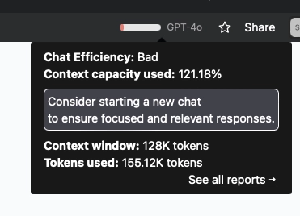

# ChatGPT上下文窗口：为什么你的对话总是"断片"?

你有没有遇到过这种情况：跟ChatGPT聊得正嗨，突然它就像失忆了一样，完全忘记你们刚才说了什么？或者回答到一半就戛然而止，像是突然断电了？

别怀疑，这不是AI在跟你闹脾气，而是你碰到了"上下文窗口"的天花板。简单说，就是ChatGPT的"记忆容量"用完了。今天咱们就来聊聊这个听起来很技术、但其实跟你日常使用息息相关的概念——以及怎么避开这些坑。

---

## 什么是上下文窗口？就是ChatGPT的"短期记忆"

**上下文窗口**说白了，就是ChatGPT在一次对话中能记住多少内容。这个"记忆容量"不是按字数算的，而是用一种叫**Token**的单位来衡量。

### Token是个啥？

你可以把Token理解成"文字碎片"。一个英文单词可能是1个Token，一个中文字可能是1-2个Token，标点符号也算。比如"ChatGPT很好用"可能就被拆成5-6个Token。

**关键数字：** ChatGPT-4的上下文窗口通常是**4096个Token**。这意味着：
- 你发的消息（输入）
- ChatGPT的回复（输出）
- 加起来不能超过这个数

一旦超了，ChatGPT就会"忘记"对话开头的内容，只保留最近的部分。



### 举个例子

假设你跟ChatGPT已经聊了3000个Token的内容，现在你问：  
**"能解释一下上下文窗口是怎么回事吗？"**（大约10个Token）

ChatGPT回答：  
**"上下文窗口就是ChatGPT能同时处理的最大Token数量，包括你的输入和我的输出。对于GPT-4来说，这个上限是4096个Token。如果超了，早期的对话内容就会被'遗忘'以腾出空间。"**（大约50个Token）

此时总Token数：3000 + 10 + 10 = 3060，还在安全范围内。

但如果你继续聊，超过4096个Token后，ChatGPT就会开始"选择性失忆"——最早的对话内容会被自动丢弃。

---

## 怎么知道自己"爆仓"了？四个明显信号

### 1. **回答突然中断**
ChatGPT说到一半就不说了，像是被人掐断了网线。

### 2. **逻辑开始混乱**
明明刚才还在讨论A话题，突然就跳到B话题，前后对不上。

### 3. **开始重复或答非所问**
它开始说一些你根本没问过的东西，或者一直重复之前的内容。

### 4. **工具直接告诉你**
有些第三方工具（比如Team-GPT）会直接显示你的Token使用情况，一目了然。

---

## 实战技巧：如何不让ChatGPT"断片"？

### 1. **定期做个总结**
别把所有历史对话都塞进去，学会"划重点"。

**错误示范：**  
"根据我们之前聊的所有内容（贴上3000字的对话记录），继续写下一部分。"

**正确姿势：**  
"基于我们讨论的核心观点：[简短总结]，请继续写下一部分。"

### 2. **把大任务拆成小步骤**
别想着一次性让ChatGPT完成所有事情，分阶段来。

**示例：**
- 第一步：生成文章大纲
- 第二步：根据大纲写引言
- 第三步：逐段写正文

### 3. **开新对话**
如果任务跨度很大，直接开个新对话窗口，别在旧对话里硬撑。

### 4. **用引用代替粘贴**
别把之前的所有内容都复制进来，改用"引用式"提问。

**示例：**  
"根据之前生成的大纲第三点，展开写一段内容。"

### 5. **监控Token使用**
如果你经常需要长对话，可以用一些工具（比如Team-GPT）来实时查看Token消耗情况。

---

## 实战案例：如何高效写一篇博客？

假设你要用ChatGPT写一篇完整的博客文章，但又担心超出上下文窗口，可以这样分步操作：

### **第一步：生成内容大纲**
```
帮我写一篇关于"用户体验如何影响数字营销"的博客大纲，包括目标读者、核心观点和SEO关键词。
```

### **第二步：基于大纲写引言**
```
根据刚才的大纲，写一段吸引人的引言（150字左右）。
```

### **第三步：逐段写正文**
```
根据大纲第一点"用户体验影响客户满意度"，写一段300字的内容。
```

如果你觉得管理Token太麻烦，想要更稳定、无限制的使用体验，👉 [这里有专为长期创作者准备的ChatGPT TEAM会员账号，30天质保，告别"断片"烦恼](https://shaoyumi.com/buy/65)。

### **第四步：总结全文**
```
根据前面写的内容，写一段总结性结语。
```

这样拆分下来，每一步的Token消耗都很少，既保证了质量，又不会触碰上下文窗口的天花板。

---

## 总结：掌握"记忆管理"，让ChatGPT更好用

上下文窗口就像ChatGPT的"短期记忆"，用好了它，你的对话体验会顺畅很多。核心就三点：
1. **别贪心**——不要一次塞太多内容
2. **会总结**——用精简的方式传达上下文
3. **分步走**——把大任务拆成小任务

如果你经常需要进行长时间、高强度的AI对话（比如写长文、做复杂分析），那么一个稳定的ChatGPT账号是刚需。👉 [这里提供ChatGPT TEAM会员特价账号，覆盖多种使用场景，质保30天，让你的创作流程更流畅](https://shaoyumi.com/buy/65)。

掌握这些技巧，你就能让ChatGPT成为真正高效的工作伙伴，而不是一个总"失忆"的助手。
